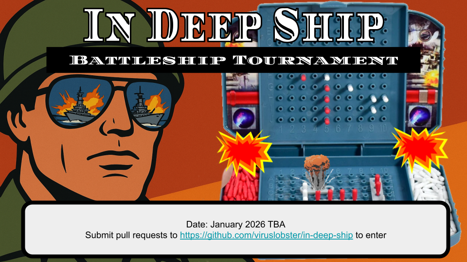

# In Deep Ship: Battleship Tournament!
Pit AI's in a battle to the death so they can't take our jobs.

## How To Enter
Submit a pull request adding your entry to `entries/`. See the example `entries/random-ralph`.
Your entry should consist of:
- A Battleship solution
- An entry name
- A 300x300 png image
- A short mp3 sound effect
- An entry.zon file, indexing the above info

## Tournament Rules
- Every contestant pair will play 1 round of 3 games.
- Each game gives +10 point for a win -10 for a loss. The contestant with the most points wins the tournament.
- Contestant programs will be created at the beginning of a round (a series of games against the same opponent) and destroyed at the end of that round.
  - You may collect and use information about an opponent's behavior throughout the round.
- You can use any programming language but no third party libraries (with some exceptions).
    - You can use numpy and scipy.stats
    - Reach out to me if you'd like to use a third party library not on this list.
- All programs will run on the same hardware. Each will be limited to 5GiB of RAM and 2 CPU cores.
- Contestants have 3 seconds start up time before each game and 1 second for each move.
    - Each time a program exceeds a time limit it will be penalized 1 point
- Contestants that make invalid moves (e.g. fire on a square outside the board or place overlapping ships) will be penalized 5 points and be asked to make another move.
- Contestants that are unresponsive or otherwise determined to be in stuck in a bad state will be restarted. If that fails the contestant may be disqualified.

## Battleship Rules
- The game is played on a 9x11 grid.
- Ships are placed horizontally or vertically within the grid without overlapping.
- The ship types are:
    - Carrier (5)
    - Battleship (4)
    - Cruiser (3)
    - Submarine (3)
    - Destroyer (2)
- Players fire on one square per turn. You know if each shot was a hit or miss. If a shot sinks a ship you also get the size of that ship.
- The first player to sink all the opponent's ships wins the game.

## Technical Details
This repo contains the Simulator which will orchestrate the tournament. The Simulator discovers contestants by reading `entries/$dirname/entry.zon` and creates them by exec-ing the corresponding `runnable`.

### Protocol Spec
Contestant programs will communicate with the Simulator by reading input from stdin and writing output to stdout via a custom text based protocol. See the `entries/random-ralph/main.py` for an example implementation of this protocol.

#### **Game Start**
- Input: `game-start`
- Output: `game-start`

Sent at the beginning of each new game. Whenever receiving this message the contestant should initialize itself to play a new game. The contestant responds when it is ready.

#### **Place Ships Request**
- Input: `place-ships`
- Output: `place-ships;(size;(vertical|horizontal);coord;?)+`
  - coord = `[A-Z][0-9]+`
  - size = `[0-9]`
  - Example: `place-ships;2;horizontal;A9;3;vertical;B4;3;horizontal;C2;4;horizontal;C3;5;horizontal;C4`

Sent after `game-start`; contestants respond with the location of all their ships. In the example the contestant has placed the cruiser (size 2) horizontally with its leftmost coordinate at A9 so that it occupies A9 and A10, the submarine (size 3) vertically with its topmost coordinate at C2 so that it occupies C2, D2 and E2, etc. If the placement is invalid (not all ships placed or ships overlap) then `place-ships` may be sent again.

#### **Take Turn**
- Input: `take-turn`
- Output: `take-turn;coord`
  - coord = `[A-Z][0-9]+`
  - Example: `take-turn;A0`

Sent at the beginning of a turn. Contestant responds with the cell they fire on (A0).

#### **Turn Result**
- Input: `turn-result;(you|enemy);coord;(miss|hit|sunk)`
  - coord = `[A-Z][0-9]+`
  - size = `[0-9]`
  - sunk = `sunk;size`
  - Examples:
    - `turn-result;you;A0;miss`
    - `turn-result;you;A0;hit`
    - `turn-result;you;A0;sunk;5`
    - `turn-result;enemy;A0;miss`
    - `turn-result;enemy;A0;hit`
    - `turn-result;you;A0;sunk;5`

A turn result is sent each time a contestant or their opponent makes a move. You always receive the coordinate that was fired on (A0). When a ship is sunk you receive the size of that ship (5).

#### **Game Result**
- Input: `(win|lose)`
  - Examples:
    - `win`
    - `lose`

Sent after each game finishes.

### Example Message Timeline
Here is an example timeline of messages from the perspective of a contestant
| Message Number | STDIN (read from)             | STDOUT (written to)      |
| -----| ----------------- | ----------- |
| 0    | game-start        |   |
| 1    | place-ships       | place-ships;2;horizontal;A9;3;vertical;B4;3;horizontal;C2;4;horizontal;C3;5;horizontal;C4 |
| 2    | take-turn              | take-turn;B4     |
| 3    | turn-result;you;B4;hit |   |
| 4    | turn-result;enemy;C9;miss |  |
| ...  | ... | ... |
| 30   | win | |
| 31   | game-start |
| 32    | place-ships       | place-ships;2;horizontal;A9;3;vertical;B4;3;horizontal;C2;4;horizontal;C3;5;horizontal;C4 |
| ... | ... | ... |

## FAQ
### When is the tournament?
We'll pick a date in mid to late January of 2026 after the new year.
### Who will compile the contestant programs?
You can leave that to me. Just create a pull request with your source the week before the tournament date and I will ensure I can compile and run your program. I'm running x86_64 Fedora 42.
### I'm using Python, should I use a virtualenv?
Yeah, otherwise we run the risk of my machine not having the right version of things. Try out [uv](https://docs.astral.sh/uv/).
### Can I declare my dependencies with nix?
Yes!
### What should I put for the runnable?
`cd entries/$ENTRY && ./$RUNNABLE` should start your program. If you're using a compiled language RUNNABLE should be where the final binary will be once compiled with `make`, `cargo build`, `zig build`, `go build`, etc. If you're using an interpreted language add a line like `#!/usr/bin/env python3` at the top of your main file and give it permission to run with `chmod +x $RUNNABLE`.
### How should I log?
Since you will be communicating with the simulator over stdout, log to stderr. Logs for the simulator and all contestants will be saved and available after the tournament.
